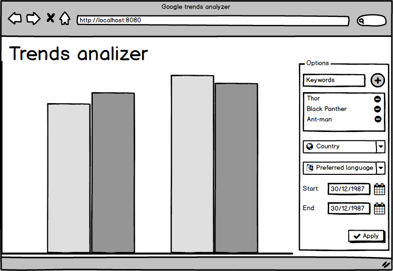

# trends-search 
  
Small study software to search trends using Google Trends API

# Requirements

- Add more then one keyword to compare
- Restrict by date
- Filter by country and language
- Present results in a chart 

# Roadmap

- Add login
- Save search preferences by user

# UI

